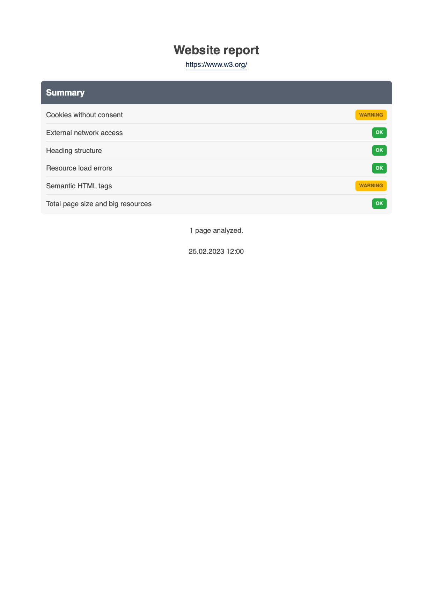
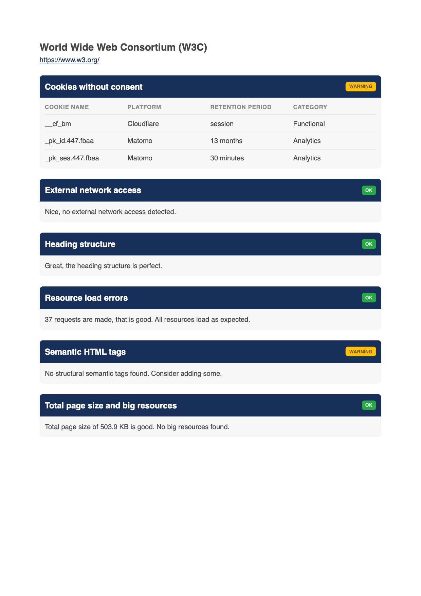
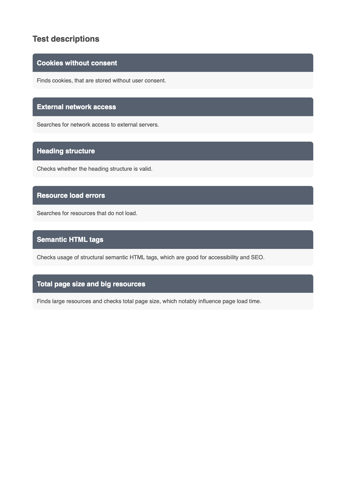

<div align="center">

# CLI Website analyzer

Simple in use, but powerful in its output.

[](https://github.com/MattHag/gdpr-website-checker-cli/actions)
[](https://coveralls.io/github/MattHag/gdpr-website-checker-cli?branch=main)
[](LICENSE)
[](https://github.com/psf/black)

</div>

Checks loading of external resources, cookies without consent and much more ...

The CLI website analyzer is a powerful command line tool that crawls a websites autonomously, analyzes each page and creates a well-structured PDF report with all its findings.


## Features

Crawl, analyze and report.

1. [Simple CLI interface](#usage)
2. Detects **cookies**
3. Find **requests to third party services** (e.g. Google Maps, Google Fonts, Youtube)
4. **Crawls** websites autonomously
5. Creates a nice **[PDF report](#pdf-report)**
6. Detects resource load errors (e.g. Status 404, DNS errors)
7. Finds **big images and pages**
8. Detects broken image links
9. Validates HTML heading structure
10. Determines the use of semantic HTML5 elements
11. Plugin system to easily add more checks


## PDF Report

The resulting report contains an overview page, followed by the detailed analyzer results per page.
In the end a description of each conducted check is attached.

<a href="./docs/examples/w3c_report-1.png">
   
</a>
<a href="./docs/examples/w3c_report-2.png">
   
</a>
<a href="./docs/examples/w3c_report-3.png">
   
</a>

[PDF Report of the W3C home page](docs/examples/w3c_report.pdf)


## Install

Clone the repository or download the ZIP file.
Then install the CLI Website analyzer.

```bash
make install
```


## Usage

Crawl and analyze a whole website and create a PDF report with all its findings.
If the given url doesn't start with 'https://', it will be added automatically.

```bash
websiteanalyzer <yourdomain>
```

### Restrict number of pages

To analyze the home page of the W3C website and create a PDF report, restrict the pages to one.

```bash
websiteanalyzer https://www.w3.org/ -p 1
```

The result is a [PDF Report of the W3C home page](docs/examples/w3c_report.pdf).

### Show all options

Help shows all available options.

```bash
$ websiteanalyzer --help
Usage: websiteanalyzer [OPTIONS] URL

Options:
  -p, --max-pages INTEGER  Crawl a maximum of n pages
  -s, --save               Save the crawled pages to a file
  -h, --help               Show this message and exit.

```

## Update data sources

An update script loads the newest cookie database from https://github.com/jkwakman/Open-Cookie-Database, checks its
compatibility and replaces the existing database.

```bash
make update
```


## Development

Get a comprehensive list of development tools.

```bash
make help
```
